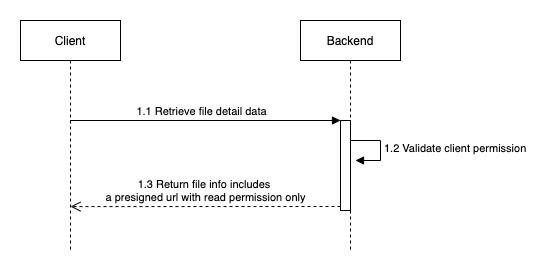

# System Design
- Describe how the system works when client upload a file to the system

## Explanation
1. Client will upload a file to the backend via a web interface
2. But instead of passing the file through the backend, the client just send the file's metadata to the backend
3. Then, the backend will store file metadata in the database and return a pre-signed URL to the client
4. Client will use the pre-signed URL to upload the file directly to the storage

### Pros & Cons

#### Pros

- Backend now is just a proxy when it comes to upload file. No need to take care about large file or multiple users upload file concurrently, that makes some benefits below:
- Better performance of API
- Avoid out of memory problem of uploading files
- Improve user experience

#### Cons:

- Backend have to trust that client always upload to cloud storage (S3) successfully once getting presigned url from backend when uploading. That makes some problems below:
- The content of file sometimes does not correct as expected
- Mismatch between expected file and uploaded file if client stops the progress in the middle of the progress or internet connection problem

## Appendix
### 1. Retrieve a file diagram

### 2. List files diagram

### 3. Delete a file diagram

